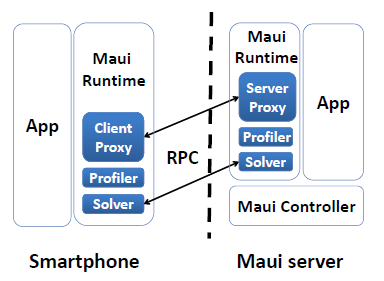
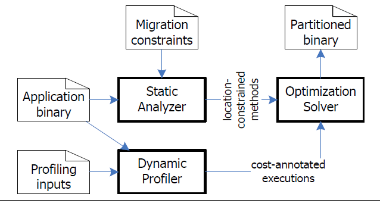
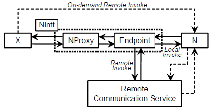

# 云-端融合下的端设备能耗优化

移动应用技术的快速发展让我们能在移动设备上从事越来越复杂的各类应用，然而这一过程中电池技术的停滞不前限制了移动应用，这也是影响用户体验的最重要因素。在电池技术本身的研究之外，软件技术层面的研究也尝试对设备能耗进行优化。传统意义上通过代码优化、漏洞检测和消除等技术实现的能耗优化仅能在一定程度上缓解。云端融合技术安模式和相应技术平台为此问题提供了一个解决方案。

## 端设备能耗问题

从1996年Palm公司发布具有128K内存、16MHz CPU的Palm Pilot个人数字助理（PDA）产品，仅经过二十年，市场上到处可见运行着Android、iOS和Windows Phone等系统的移动设备已具有和桌面型电脑相当的硬件配置了。移动终端的计算能力增长的成百上千倍，其上的应用软件从当初的简单的文本、数值存取处理逐步演化为各类复杂信息、娱乐和通信等应用。在用户期待以移动终端设备替换传统桌面和膝上型设备之时，发展相对缓慢的电池技术限制了这一趋势的进一步实现。设备电力续航条件的限制使得应用无法以不及开销的方式运行消耗设备电力资源，这在一定程度上影响了应用性能和相应的用户体验，并且，不恰当的设计更会因为过度消耗电能而进一步影响用户体验。

针对这一问题，相关研究从应用开发运行相关的x工程和技术的角度尝试优化应用能耗。例如Ding Li等人的工作[14]从编码的角度出发，提出一些可以降低能耗的编程经验，并且对一些被推荐的编程经验（例如Android开发者网站上给出的一些建议[15]）进行实验验证，为应用开发者提供降低能耗的指导建议。Mario Linares-Vásquez等人的工作[16]将外部设备测出的能耗数据与执行路径对应起来，统计每个API调用的能耗，并提出了避免使用能耗高的API，而尽量使用功能相同的能耗低的API，来降低应用能耗的方法。Android系统自身也在针对应用能耗进行优化。例如Android运行时Dalvik和ART，Dalvik采用即时编译策略，在程序运行时将字节码翻译成机器码来执行，这样运行时开销就增加了，能耗也就增加了；新的运行时ART采用预编译策略，在程序安装时就将字节码翻译成机器码，降低了运行时开销，也就降低了能耗。

部分工作着重优化能耗较高的设备部件的使用。例如针对高能耗的GPS调用，Zhenyun Zhuang等人的工作[12]也提出了相应的应用能耗优化方法。比如利用能耗更低的基于无线网络的位置感知技术来代替GPS调用；利用加速度传感器来判断用户的运动状态，如果用户是静止的，则限制不必要的GPS调用；将来自不同应用的GPS调用请求进行同步以减少GPS的调用次数；调整GPS调用的请求参数，等等。最终达到了降低98%的GPS调用的能耗的效果。针对高能耗的Wi-Fi接入点扫描，Kyu-Han Kim等人的工作[13]也提出了根据用户的运动状态和Wi-Fi接入点的密度来调整Wi-Fi接入点扫描的间隔，最终达到了降低79%的Wi-Fi接入点扫描的次数的效果。屏幕能耗占应用总能耗的一大部分，降低屏幕能耗能在很大程度上降低应用的能耗。而如今许多Android设备都配有OLED屏幕，其能耗不仅受到屏幕亮度，还受到显示的内容的颜色的影响，在屏幕亮度相同的条件下，显示暗一点的颜色，如黑色、灰色等，要比显示亮一点的颜色，如白色、黄色等的能耗更低。南京大学发表的工作[10]就据此对Android系统能耗配置文件中的屏幕能耗模型做出了改进。另外，Mian Dong等人的工作[11]指出，由于许多Web应用的背景色都是白色，这并不是一个节省能耗的做法，于是他们调整Web应用的配色方案，让面积更大的背景色变为黑色，以此来降低Web应用的能耗。当然这种方法不限于Web应用，许多背景色是白色的Android应用都可以针对屏幕能耗做出改进。

应用开发中能耗相关的不当设计称为能耗漏洞或能耗Bug，能耗Bug不会影响应用的功能，也不会引起应用崩溃，只会让应用消耗更多的电量，并且用户往往很难发现。部分研究工作通过静态或动态方式进行检测。典型的能耗Bug例如No-sleep Bug。Android系统为了省电，会在用户无操作一段时间后进入休眠状态，但这经常会影响一些应用的功能。于是Android系统提供了WakeLock机制。WakeLock是一种锁机制，只要系统中有应用申请了WakeLock，系统就无法进入休眠状态，直到WakeLock被释放。然而有些应用申请了WakeLock，却忘记将它释放，或由于某些原因没有执行到释放WakeLock的代码，导致系统永远无法进入休眠状态，这样就产生了一个No-sleep Bug。Abhinav Pathak等人的工作[7]通过数据流分析的方法检测可能导致No-sleep Bug的运行路径，并添加释放WakeLock的代码来进行修复。另一类能耗Bug与传感器不当使用相关，某些Android应用会申请一些能耗较高的传感器资源，例如GPS，但在使用完后忘记将其释放，导致后台不断地获取传感器数据，而这些数据又无任何实际用途，造成能耗漏洞。可以看出，Sensor-related Bug与No-sleep Bug的模式非常类似，南京大学发表的工作[8]同样通过数据流分析的方法进行检测并修复。

能耗Bug不仅可以从应用的字节码来检测，还可以从应用的实际能耗行为来分析。例如Abhijeet Banerjee等人的工作[9]利用外部设备测量应用运行过程中的能耗，如果在应用运行之前和运行完毕后，设备的能耗行为不相似，则可以认为执行路径中存在能耗Bug。虽然这是一个利用外部设备的“离线”方法，但由于其目的是检测能耗Bug，因此并无大碍。

能耗漏洞检测、编程优化等,但这些只在一定程度上缓解了设备的能耗问题。

能耗的主要问题是在部件方面消耗的，因此云端融合的基本思路是希望能让终端应用去使用云端设备的耗电部件（CPU、网络、传感器等），相关工作由此展开

云端融合是解决设备能耗问题的一个重要方式，这一技术方式为解决能耗问题提供了各种可能和无限想象

## 云端融合的能耗优化技术

云端融合技术在工业界产品中已有较为广泛的应用。2011年亚马逊公司在其推出的Fire平板电脑上安装了Silk浏览器，该浏览器的架构体现了较为典型的云-端融合技术特点。当用户选择以“云模式”运行时，Silk将用户输入的URL直接传递到Amazon的EC2云服务，在EC2云服务端完成该URL相关的HTML、CSS、图片、JavaScript等资源。在此过程中EC2云服务还可为Silk浏览器进行资源优化，例如根据客户端分辨率自动进行所下载图片的处理以适配端设备分辨率，并且EC2云服务中还可实现机器学习算法以预测用户将访问的内容，通过对内容预加载实现用户浏览的加速。此外，Silk还可将部分渲染过程相关计算off-load到Amazon的EC2云服务，包括HTML、CSS和JS等文件的解析和渲染树构造等步骤，进一步提升用户渲染过程的效率。

语音识别是当前应用较为广泛的云-端融合技术的应用场景，各类移动应用集成语音识别功能为用户提供友好的文字输入界面。因语音识别技术一般需要通过神经网络算法进行复杂计算后完成语音识别过程，而移动设备本身不具备进行如此重量级计算的资源，因此用户在移动端设备上进行语音采集后编码压缩为数字格式并通过无线网络传输到云服务器，服务器通过将该语音信号和某一统计模型进行比较，猜测最可能且合理的对应文字内容，并将结果返回。而类似Siri等语音助手，还需要进一步将人工智能、人机交互及智能搜索等技术紧密地联系起来，在云端实现对用户所说的话进行理解，并快速寻找答案以语音的方式回答用户。

以在线流媒体方式从云端获取音乐和电影成为当前内容消费的主要形式。这一云资源应用形态也在被用于计算机游戏行业。NVIDIA公司正在开发的GRID云游戏技术在云端服务器内将3D游戏进行渲染和编码，并以流方式将结果通过有线或无线网络传输到用户的各类设备。游戏软件的升级无需用户进行下载、打补丁甚至重新安装，游戏软件对底层软硬件的升级要求也无需用户进行相应更新。用户个性配置和进度都在云端保存，这一技术使得用户任何时刻都可以在电视、PC、Mac、平板电脑和手机等各类设备上即时开启游戏，享受“游戏即为服务”（Gaming as a Service, GaaS)所带来的乐趣。

## 基于计算迁移的融合
在“云-端融合”的技术理念下，将应用的部分计算任务迁移到云端来执行，在利用云端丰富的计算资源（如CPU、内存等）的同时，也可以优化端移动设备上应用的能耗，其问题的关键在于如何进行计算任务迁移。

计算迁移实现的基本方法为将应用的部分或全部代码预先或运行时拷贝至其他计算设备，并在运行时某一时刻执行。。。这一技术在九十年代时曾获广泛研究，在当时的互联网技术条件、特别是移动互联网初现的情况下，传统分布式计算模式面临计算节点间通信信道带宽窄、延时高、稳定性差等因素导致的远程调用低效问题，相应研究所产生的Aglets、 DAgent、TCL、Mogent等移动代理技术通过在运行时将部分代码（特别是远程方法调用部分的代码）迁移至被调用方，避免了应用需要长时间维持可靠稳定通信信道的要求，实现了更为可靠、灵活的面向互联网的分布式计算模型。

基于代码迁移的云端融合本质上采用同样的技术方法，通过将代码执行迁移到原创服务器或云环境，实现对云端计算、存储和网络资源的利用，减轻了移动设备本身的资源负担，提高了应用性能并节省了移动设备能耗。基于这一思路，出现了一系列研究工作，比较具有代表性的工作包括MAUI、CloneCloud和DPartner等。

### MAUI
MAUI是Eduardo Cuervo等人在2010年发布的一项较为全面实现移动设备计算迁移的研究工作[17]。与本领域其他工作类似，为屏蔽不同平台硬件异构问题（主要为移动设备主要基于的ARM平台和云端主要的x86平台），MAUI在Microsoft公司.NET公共语言运行时（.NET CLR）上实现代码和计算的运行时迁移，支持在应用运行时细粒度地决定哪些代码迁移到云端运行，并通过实验验证了MAUI系统可有效降低应用在移动设备上的能耗。

MAUI设计了一个较为简单的开发框架，移动应用开发人员在该框架下可对其开发的应用进行注释（Annotating），将那些可以迁移到云端运行的方法标注为Remoteable方法。在应用运行时，通过自省技术（Reflection）对标注为Remoteable的方法进行辨识，当某个Remoteable方法被调用并且有可用的远程服务器时，MAUI就用它的决策引擎来决定该方法是否应该迁移到远程执行以降低应用的能耗。MAUI通过根据Remoteable方法迁移到远程执行所需要传输的状态信息的数量，来分析迁移的成本，通过统计利用迁移节省的CPU周期的数量，来分析迁移的收益。另外，MAUI持续地监控移动设备的网络情况，评估带宽和延迟，作为其决策引擎的参数，以此适应网络环境的变化。

如图所示为MAUI的系统架构。在移动设备上，MAUI主要包括三个组件：客户端代理（Client Proxy），负责待迁移方法的状态信息的传输；分析器（Profiler），负责分析方法迁移的成本和收益；决策引擎（Solver），为了降低能耗，它实际运行在MAUI服务器上。在MAUI服务器上，它主要包括四个组件：服务端代理（Server Proxy）和分析器（Profiler），与移动设备上相应的组件功能一致；决策引擎（Solver），定期地对方法是否需要迁移进行决策；以及MAUI控制器（MAUI Controller），用于对方法迁移请求进行身份验证和资源分配。

文[17]介绍了针对MAUI平台做的一组实验，作者选取了面部识别、视频游戏和国际象棋三类应用通过MUAI进行计算迁移，开展了应用性能和在移动设备上的能耗等方面的比对评估。实验结果表明，计算迁移除了可以较为显著提升应用性能，在使用WiFi进行通信的场景下也能对有效降低应用在移动设备端所消耗的电能，特别是将面部识别这个CPU密集型的脸部识别应用的核心算法迁移到远程执行，可降低了该应用90%左右的能耗。

### 基于虚拟机克隆的CloneCloud系统

MUAI这项研究给出了通过计算迁移进行移动端能耗优化的一个可行性验证的完整方案，但这一技术对代码可迁移性的判断依赖于开发人员手工进行。这一方式一方面为开发人员带来了额外负担，另一方面开发人员可能错误地将不可迁移的代码指定为可迁移，例如某些访问移动设备特有的传感器等本地资源的代码迁移到云端运行会发生错误。这一问题在于MAUI类似的CloneCloud系统中得以解决[18]。CloneCloud使用静态代码分析和动态环境分析相结合的方法，对应用代码进行划分（Partitioning），划分的流程如图所示。其中，静态分析器（Static Analyzer）通过静态代码分析，根据一系列限制条件的判定识别出可以迁移到云端运行的方法，这些限制条件包括1）需要访问本地资源的代码必须留在本地执行；2）共享本地状态的代码必须在同一设备上执行；3）防止出现嵌套迁移。通过静态分析器作此划分相当于MAUI系统中通过开发人员注释出的Remoteable方法，因此CloneCloud不需要开发人员的参与。动态分析器（Dynamic Profiler）结合本地和云端的网络环境等条件分析应用代码迁移的成本和收益，构造代码迁移的开销函数。最后由最优化求解器（Optimization Solver）给出一个执行时间最短或能耗最低的运行时应用划分方法，将应用的一部分留在本地运行，另一部分迁移到云端运行。

如下图所示为CloneCloud的系统架构。CloneCloud在云端为移动设备创建克隆的虚拟机。在应用的运行过程中，如果遇到一个迁移节点，正在运行的线程会被阻塞，它的相关状态信息被发送到云端，由云端继续运行该线程，它可以访问云端的各种资源，例如更快的CPU、网络，更大的内存等等；本地应用的其他功能（线程）不会受到影响，但如果它们试图访问迁移到云端的线程的相关状态信息，就会进入阻塞状态；当迁移到云端的线程执行完毕时，相关的状态信息被发送回本地，合并到本地被阻塞的线程中去，本地被阻塞的线程将被唤醒并继续执行。

CloneCloud的作者Byung-Gon Chun等实现了CloneCloud原型系统并选取了病毒扫描、图像搜索和用户行为追踪等三个应用开展了实验，实验结果同样显示使用计算迁移技术在提升应用运行性能的同时能在大部分情况下降低应用对移动端设备电能的消耗，特别在计算量大的情况下效果有尤为显著。实验中图像搜索应用的输入达到100个图像时，搜索过程的能耗降低了95%。

###基于应用重构的DPartner 

CloneCloud的系统支持了自动对代码进行划分并在运行时完成方法粒度的计算迁移，这一技术依赖于对应用运行底层的虚拟机（Dalvik VM）进行修改以实现应用计算线程暂停、计算现场获取和运行恢复合并等机制。其通过这种方式所实现的计算迁移能力虽强，但对底层机制的修改却也限制了其适用场景并降低了用户接受度，因为对虚拟机修改可能导致各类安全性问题；同时也带来了技术可维护性的问题，例如当前Android平台的底层虚拟机正迁向新一代的ART（Android Runtime），原有Dalvik VM上所做的实现能否有效地在ART上进行实现还处于未知状态。

北京大学发表的工作[19]提出了基于应用自动化重构实现计算迁移的技术较为有效地解决了这些问题。文中分析，由于Android应用本质上是由许多类组成的Java程序，一项计算任务被实现为某个类中的某个方法，它可以被本类或其他类中的方法调用，因此Android应用计算任务迁移可以实现为包含该计算任务的某个类的远程部署和调用。该工作首先提出了一种支持Android应用计算任务按需远程执行的程序结构，它主要包含两个核心元素：proxy和endpoint，如图所示。它将调用者X和被调用者N之间的直接内存调用以及通过RCS（Remote Communication Service，远程通信服务）的远程调用都转换成了经由proxy和endpoint进行的间接调用。NProxy的外部行为和N完全一致，只是它本身不执行任何实际的计算操作，只负责将方法调用转发到N执行。Endpoint负责获取N当前的位置并提供N的引用供X使用。若N运行在远程节点，则Endpoint会通过RCS获得N的远程引用，并把该引用以NProxy的形式提供给X使用；若N运行在本地节点，Endpoint会直接获得对N的内存引用，并同样以NProxy的形式提供给X使用。

在确定了支持Android应用计算任务按需远程执行的程序结构之后，该工作设计实现了自动地对Android应用进行重构以符合该程序结构的工具——DPartner。它首先对Android应用中的类进行分类：必须留在本地执行的anchored类（它们使用了一些只能在本地才能获取的特殊资源，如GUI或传感器等）和可以被迁移到云端执行的movable类。然后进行应用类转换，当一个movable类被迁移到云端时，与之交互的类都需要被转换成可按需远程调用的结构，即生成被调用者的代理类proxy，并重写调用类来使用proxy。接着进行应用类聚类，为了使计算任务远程执行能够提高应用的性能，降低应用的能耗，必须避免频繁的网络调用所带来的负面影响，因此需要把相互间调用频繁的类作为一个整体迁移到云端执行。最后进行应用类封装，生成两部分制品，一部分是转换后留在本地运行的应用，另一部分是转换后的movable类组成的集合，部署到云端以供远程调用。

该工作还提出了计算任务是否需要远程执行的运行时决策模型，该模型基于各个应用类的工作负载、内存消耗，应用类之间的交互频率、传输数据量大小，本地和远程节点的处理能力、内存大小，以及它们之间的网络延迟等，以应用的性能与资源消耗的比值为目标，决定最终应用中的计算任务是否需要远程执行。

于MAUI等工作类似，作者选取了计算密集（Linpack）、交互性游戏（3D赛车）和计算交互兼具（国际象棋）等三类应用开展实验，实验结果表明，重构后的Android应用在网络通讯不频繁的计算密集型Android应用运行时能降低其在移动设备端27~83%的能耗，在游戏类交互性应用中随能耗平均降低仅约25%，但应用性能提升还是较为明显。

## 设备嫁接（Sensor Offloading）