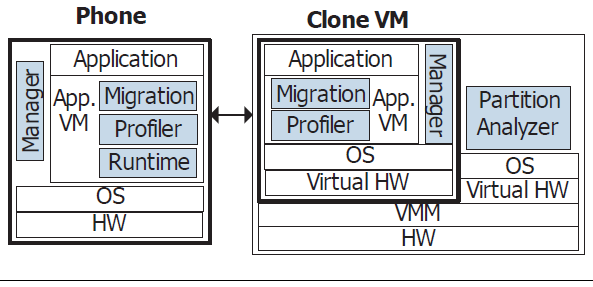

# 云-端融合下的端设备能耗优化

移动应用技术的快速发展让我们能在移动设备上从事越来越复杂的各类应用，然而这一过程中电池技术的停滞不前限制了移动设备上应用场景和能力，这也成为了影响用户体验的最重要因素。针对这一问题，在电池技术本身的研究之外，软件技术层面的研究也尝试对设备能耗进行优化。传统意义上通过代码优化、漏洞检测和消除等技术实现的能耗优化仅能在一定程度上缓解运动设备的能耗问题，而云端融合计算模式和相应技术平台为此问题提供了一个全新的解决方案。本文并不试图对该领域工作进行完整综述，而是通过几个较为典型工作的简介展示这种以计算迁移实现的云端融合计算模式在解决终端能耗优化问题上的技术方法及讨论在此技术领域中仍存在的技术挑战，以此为更近一步发挥云端融合技术优势提供部分思路。

## 端设备能耗问题

从1996年Palm公司发布具有128K内存、16MHz CPU的Palm Pilot个人数字助理（PDA）产品，仅经过二十年，市场上随处可见运行着Android、iOS和Windows Phone等系统的移动设备已具有了与当下主流桌面型电脑相当的硬件配置。移动终端的计算能力增长的成百上千倍，其上的应用软件从当初的简单的文本、数值存取处理逐步演化为各类复杂信息、娱乐和通信等应用。在用户期待以移动终端设备替换传统桌面和膝上型设备之时，发展相对缓慢的电池技术限制了这一趋势的进一步实现。设备电力续航条件的限制使得应用无法以不计开销的方式运行消耗设备电力资源，这在很大程度上影响了应用性能和相应的用户体验。

应用产生能耗过度的问题主要原因包括应用本身存在恶意行为（例如过度显示广告内容等）和应用本身的设计／实现缺陷。前者源自设计者主观因素，因此主要通过识别具有恶意行为的应用让用户终端的电量资源避免被恶意消耗[1][2]。后者则是软件技术研究的重点，通过应用设计和实现的改进优化终端系统的能耗水平，提升用户体验。

### 应用软件能耗优化

针对终端应用能耗过高这一问题，相关研究从应用开发运行相关技术和工程角度尝试优化应用能耗。例如Ding Li等人的工作[3]从编码的角度出发，提出一些可以降低能耗的编程经验，并且对一些被推荐的编程经验（例如Android开发者网站上给出的一些最佳实践[4]）进行实验验证，为应用开发者提供降低能耗的指导建议。Mario Linares-Vásquez等人将外部设备测出的能耗数据与执行路径对应起来，统计每个API调用的能耗，并提出了避免使用能耗高的API，而尽量使用功能相同的能耗低的API，来降低应用能耗的方法[5]。Android系统(Footage：因其他主流移动平台的封闭性，当前研究主要针对Android系统开展工作，本文也主要针对Android平台展开技术介绍和讨论)自身也在针对应用能耗进行优化。例如Android运行时Dalvik和ART，Dalvik采用即时编译策略，在程序运行时将字节码翻译成机器码来执行，这样运行时开销就增加了，能耗也就增加了；新的运行时ART采用预编译策略，在程序安装时就将字节码翻译成机器码，降低了运行时开销，也就降低了能耗。

应用开发中能耗相关的不当设计称为能耗漏洞或能耗Bug，能耗Bug不会影响应用的功能，也不会引起应用崩溃，只会让应用消耗更多的电量，并且用户往往很难发现。部分研究工作通过静态或动态方式进行检测。典型的能耗Bug为“No－sleep Bug”。Android系统为了节省能耗会在用户无操作一段时间后进入休眠状态，但这经常会影响一些应用的功能，于是Android系统提供了WakeLock机制。WakeLock是一种锁机制，只要系统中有应用申请了WakeLock，系统就无法进入休眠状态，直到WakeLock被释放。然而有些应用申请了WakeLock，却忘记将它释放，或由于某些原因没有执行到释放WakeLock的代码，导致系统永远无法进入休眠状态，这样就产生了一个No-sleep Bug。Abhinav Pathak等人的工作[6]通过数据流分析的方法检测可能导致No-sleep Bug的运行路径，并添加释放WakeLock的代码来进行修复。另一类能耗Bug与传感器不当使用相关，某些Android应用会申请一些能耗较高的传感器资源，例如GPS，但在使用完后忘记将其释放，导致后台不断地获取传感器数据，而这些数据又无任何实际用途，造成能耗漏洞。可以看出，Sensor-related Bug与No-sleep Bug的模式非常类似，文[7]同样通过数据流分析的方法进行检测并修复。能耗Bug不仅可以从应用的字节码来检测，还可以从应用的实际能耗行为来分析。例如Abhijeet Banerjee等人的工作[8]利用外部设备测量应用运行过程中的能耗，如果在应用运行之前和运行完毕后，设备的能耗行为不相似，则可以认为执行路径中存在能耗Bug。

### 硬件部件能耗优化

优化终端能耗的另一个思路是在硬件部件层面进行能耗优化过程。从根本而言，设备运行时的能量是在硬件部件上消耗的，因此部分工作着重优化能耗较高的设备部件的使用。例如针对高能耗的GPS调用，Zhenyun Zhuang等人的工作[9]提出了相应的应用能耗优化方法。比如利用能耗更低的基于无线网络的位置感知技术来代替GPS调用；利用加速度传感器来判断用户的运动状态，如果用户是静止的，则限制不必要的GPS调用；将来自不同应用的GPS调用请求进行同步以减少GPS的调用次数；调整GPS调用的请求参数，等等。最终达到了降低98%的GPS调用的能耗的效果。针对高能耗的Wi-Fi接入点扫描，Kyu-Han Kim等人的工作[10]也提出了根据用户的运动状态和Wi-Fi接入点的密度来调整Wi-Fi接入点扫描的间隔，最终达到了降低79%的Wi-Fi接入点扫描的次数的效果。屏幕能耗占应用总能耗的一大部分，降低屏幕能耗能在很大程度上降低应用的能耗。而如今许多Android设备都配有OLED屏幕，其能耗不仅受到屏幕亮度，还受到显示的内容的颜色的影响，在屏幕亮度相同的条件下，显示稍暗的黑色、灰色等颜色要比显示稍亮的白色、黄色等颜色的能耗更低。南京大学发表的工作[11]就据此对Android系统能耗配置文件中的屏幕能耗模型做出了改进。另外，Mian Dong等人的工作[12]指出，由于许多Web应用的背景色都是白色，这并不是一个节省能耗的做法，于是他们调整Web应用的配色方案，让面积更大的背景色变为黑色，以此来降低Web应用的能耗。当然这种方法不限于Web应用，许多背景色是白色的Android应用都可以针对屏幕能耗做出改进。

## 云端融合的终端能耗优化

应用软件层面的编程优化、能耗漏洞检测和硬件层面的部件能耗优化提升了终端能耗效率，但这些立足于终端本身的技术方法只在一定程度上缓解了设备的过度耗能问题，其优化空间的最终上限为完成应用逻辑本身所必需的基础能耗。

云端融合技术则为终端能耗优化研究提供了一个完全不同的技术方向，其基本思路是是在终端之外，即云端，提供可用资源支持终端应用的运行，从而节省应用在终端本身运行时在各个耗电部件（CPU、网络、传感器等）上所需消耗的能量。换而言之，云端融合技术将云作为终端的延伸，通过将应用计算（代码）从终端迁移至云端运行，实现以云资源于终端资源的合并，共同完成应用运行支撑。这一技术方式为解决能耗问题提供了各种可能和无限想象。

<!-- 
云端融合技术在工业界产品中已有较为广泛的应用，例如亚马逊公司在其推出的Fire平板电脑上安装了Silk浏览器可将用户输入的URL直接传递到Amazon的EC2云服务，在EC2云服务端完成该URL相关的HTML、CSS、图片、JavaScript等资源的加载、优化和处理；Siri等语音识别功能在移动端设备上进行语音采集后编码压缩为数字格式并通过无线网络传输到云服务器进行识别，或进一步结合人工智能、人机交互及智能搜索等技术对用户语言进行理解；NVIDIA公司正在开发的GRID云游戏技术在云端服务器内将3D游戏进行渲染和编码，并以流方式将结果通过有线或无线网络传输到用户的各类设备，使得用户任何时刻都可以在电视、PC、Mac、平板电脑和手机等各类设备上即时开启游戏，享受“游戏即为服务”所带来的乐趣。
-->

### 基于计算迁移的能耗优化

在“云-端融合”的技术理念下，将应用的部分计算任务迁移到云端来执行，在利用云端丰富的计算资源（如CPU、内存等）的同时，也可以优化端移动设备上应用的能耗，其问题的关键在于如何进行计算任务迁移。

计算迁移实现的基本方法为将应用的部分或全部代码预先或运行时拷贝至远程的其它计算设备，并在运行时某一时刻在该远程设备上执行这些代码。这一技术在九十年代时曾获广泛研究，在当时的互联网技术条件、特别是移动互联网初现的情况下，传统分布式计算模式面临计算节点间通信信道带宽窄、延时高、稳定性差等因素导致的远程调用低效问题，相应研究所产生的Aglets、 DAgent、TCL、Mogent等代码移动技术（称为移动代理技术）通过在运行时将部分代码（特别是远程方法调用部分的代码）迁移至被调用方，避免了应用需要长时间维持可靠稳定通信信道的要求，实现了更为可靠、灵活的面向互联网的分布式计算模型。

基于计算（代码）迁移的云端融合本质上采用同样的技术方法，通过将代码执行迁移到原创服务器或云环境，实现对云端计算、存储和网络资源的利用，减轻了移动设备本身的资源负担，提高了应用性能并节省了移动设备能耗。基于这一思路，出现了一系列研究工作，比较具有代表性的工作包括MAUI、CloneCloud和DPartner等。

#### MAUI
MAUI是Eduardo Cuervo等人在2010年发布的一项较为全面实现移动设备计算迁移的研究工作[13]。与本领域其他工作类似，为屏蔽不同平台硬件异构问题（主要为移动设备主要基于的ARM平台和云端主要的x86平台），MAUI在Microsoft公司.NET公共语言运行时（.NET CLR）上实现代码和计算的运行时迁移，支持在应用运行时细粒度地决定哪些代码迁移到云端运行，并通过实验验证了MAUI系统可有效降低应用在移动设备上的能耗。

MAUI设计了一个较为简单的开发框架，移动应用开发人员在该框架下可对其开发的应用进行注释（Annotating），将那些可以迁移到云端运行的方法标注为`Remoteable`方法。在应用运行时，通过自省技术（Reflection）对标注为Remoteable的方法进行辨识，当某个`Remoteable`方法被调用并且有可用的远程服务器时，MAUI就用它的决策引擎来决定该方法是否应该迁移到远程执行以降低应用的能耗。MAUI通过根据Remoteable方法迁移到远程执行所需要传输的状态信息的数量，来分析迁移的成本，通过统计利用迁移节省的CPU周期的数量，来分析迁移的收益。另外，MAUI持续地监控移动设备的网络情况，评估带宽和延迟，作为其决策引擎的参数，以此适应网络环境的变化。

如图所示为MAUI的系统架构。在移动设备上，MAUI主要包括三个组件：客户端代理（Client Proxy），负责待迁移方法的状态信息的传输；分析器（Profiler），负责分析方法迁移的成本和收益；决策引擎（Solver），为了降低能耗，它实际运行在MAUI服务器上。在MAUI服务器上，它主要包括四个组件：服务端代理（Server Proxy）和分析器（Profiler），与移动设备上相应的组件功能一致；决策引擎（Solver），定期地对方法是否需要迁移进行决策；以及MAUI控制器（MAUI Controller），用于对方法迁移请求进行身份验证和资源分配。

文[13]介绍了针对MAUI平台做的一组实验，作者选取了面部识别、视频游戏和国际象棋三类应用通过MUAI进行计算迁移，开展了应用性能和在移动设备上的能耗等方面的比对评估。实验结果表明，计算迁移除了可以较为显著提升应用性能，在使用WiFi进行通信的场景下也能对有效降低应用在移动设备端所消耗的电能，特别是将面部识别这个CPU密集型的脸部识别应用的核心算法迁移到远程执行，可降低了该应用90%左右的能耗。

#### CloneCloud

MUAI这项研究给出了通过计算迁移进行移动端能耗优化的一个可行性验证的完整方案，但这一技术对代码可迁移性的判断依赖于开发人员手工进行。这一方式一方面为开发人员带来了额外负担，另一方面开发人员可能错误地将不可迁移的代码指定为可迁移，例如某些访问移动设备特有的传感器等本地资源的代码迁移到云端运行会发生错误。这一问题在于MAUI类似的CloneCloud系统中得以解决[14]。CloneCloud使用静态代码分析和动态环境分析相结合的方法，对应用代码进行划分（Partitioning），划分的流程如图所示。其中，静态分析器（Static Analyzer）通过静态代码分析，根据一系列限制条件的判定识别出可以迁移到云端运行的方法，这些限制条件包括1）需要访问本地资源的代码必须留在本地执行；2）共享本地状态的代码必须在同一设备上执行；3）防止出现嵌套迁移。通过静态分析器作此划分相当于MAUI系统中通过开发人员注释出的Remoteable方法，因此CloneCloud不需要开发人员的参与。动态分析器（Dynamic Profiler）结合本地和云端的网络环境等条件分析应用代码迁移的成本和收益，构造代码迁移的开销函数。最后由最优化求解器（Optimization Solver）给出一个执行时间最短或能耗最低的运行时应用划分方法，将应用的一部分留在本地运行，另一部分迁移到云端运行。

如下图所示为CloneCloud的系统架构。CloneCloud在云端为移动设备创建克隆的虚拟机。在应用的运行过程中，如果遇到一个迁移节点，正在运行的线程会被阻塞，它的相关状态信息被发送到云端，由云端继续运行该线程，它可以访问云端的各种资源，例如更快的CPU、网络，更大的内存等等；本地应用的其他功能（线程）不会受到影响，但如果它们试图访问迁移到云端的线程的相关状态信息，就会进入阻塞状态；当迁移到云端的线程执行完毕时，相关的状态信息被发送回本地，合并到本地被阻塞的线程中去，本地被阻塞的线程将被唤醒并继续执行。

CloneCloud的作者Byung-Gon Chun等实现了CloneCloud原型系统并选取了病毒扫描、图像搜索和用户行为追踪等三个应用开展了实验，实验结果同样显示使用计算迁移技术在提升应用运行性能的同时能在大部分情况下降低应用对移动端设备电能的消耗，特别在计算量大的情况下效果有尤为显著。实验中图像搜索应用的输入达到100个图像时，搜索过程的能耗降低了95%。

#### DPartner 

CloneCloud的系统支持了自动对代码进行划分并在运行时完成方法粒度的计算迁移，这一技术依赖于对应用运行底层的虚拟机（Dalvik VM）进行修改以实现应用计算线程暂停、计算现场获取和运行恢复合并等机制。其通过这种方式所实现的计算迁移能力虽强，但对底层机制的修改却也限制了其适用场景并降低了用户接受度，因为对虚拟机修改可能导致各类安全性问题；同时也带来了技术可维护性的问题，例如当前Android平台的底层虚拟机正迁向新一代的ART（Android Runtime），原有Dalvik VM上所做的实现能否有效地在ART上进行实现还处于未知状态。

北京大学发表的工作[15]提出了基于应用自动化重构实现计算迁移的技术较为有效地解决了这些问题。文中分析，由于Android应用本质上是由许多类组成的Java程序，一项计算任务被实现为某个类中的某个方法，它可以被本类或其他类中的方法调用，因此Android应用计算任务迁移可以实现为包含该计算任务的某个类的远程部署和调用。该工作首先提出了一种支持Android应用计算任务按需远程执行的程序结构，它主要包含两个核心元素：proxy和endpoint，如图所示。它将调用者X和被调用者N之间的直接内存调用以及通过RCS（Remote Communication Service，远程通信服务）的远程调用都转换成了经由proxy和endpoint进行的间接调用。NProxy的外部行为和N完全一致，只是它本身不执行任何实际的计算操作，只负责将方法调用转发到N执行。Endpoint负责获取N当前的位置并提供N的引用供X使用。若N运行在远程节点，则Endpoint会通过RCS获得N的远程引用，并把该引用以NProxy的形式提供给X使用；若N运行在本地节点，Endpoint会直接获得对N的内存引用，并同样以NProxy的形式提供给X使用。

在确定了支持Android应用计算任务按需远程执行的程序结构之后，该工作设计实现了自动地对Android应用进行重构以符合该程序结构的工具——DPartner。它首先对Android应用中的类进行分类：必须留在本地执行的anchored类（它们使用了一些只能在本地才能获取的特殊资源，如GUI或传感器等）和可以被迁移到云端执行的movable类。然后进行应用类转换，当一个movable类被迁移到云端时，与之交互的类都需要被转换成可按需远程调用的结构，即生成被调用者的代理类proxy，并重写调用类来使用proxy。接着进行应用类聚类，为了使计算任务远程执行能够提高应用的性能，降低应用的能耗，必须避免频繁的网络调用所带来的负面影响，因此需要把相互间调用频繁的类作为一个整体迁移到云端执行。最后进行应用类封装，生成两部分制品，一部分是转换后留在本地运行的应用，另一部分是转换后的movable类组成的集合，部署到云端以供远程调用。

该工作还提出了计算任务是否需要远程执行的运行时决策模型，该模型基于各个应用类的工作负载、内存消耗，应用类之间的交互频率、传输数据量大小，本地和远程节点的处理能力、内存大小，以及它们之间的网络延迟等，以应用的性能与资源消耗的比值为目标，决定最终应用中的计算任务是否需要远程执行。

于MAUI等工作类似，作者选取了计算密集（Linpack）、交互性游戏（3D赛车）和计算交互兼具（国际象棋）等三类应用开展实验，实验结果表明，重构后的Android应用在网络通讯不频繁的计算密集型Android应用运行时能降低其在移动设备端27~83%的能耗，在游戏类交互性应用中随能耗平均降低仅约25%，但应用性能提升还是较为明显。

#### ThinkAir

在终端和云端间进行计算迁移的主要问题在于云端缺乏真实的终端运行环境，因此前述工作对应用可迁移部分的限制条件较为苛刻，一般而言仅与移动平台无关的计算部分可迁移到云端执行。为此Sokol Kosta等提出一项称为ThinkAir[16]的工作，在云端提供完整的Anroid x86架构虚拟机环境以运行从终端所迁移而来的计算任务。其系统架构如下图所示。

ThinkAir提供一个与MAUI类似的简单编程框架，允许用户将某个可进行计算迁移的Java方法标注为`@Remote`，并由ExecutionController在运行时进行计算迁移的决策。迁移决策过程同样会综合考虑网络质量等环境因素、待迁移方法既往在本地的执行时间和能耗等应用因素以及商业云资源的使用代价因素等。云端管理器Application Server则通过Client Handler组件与终端ExecutionController交互完成代码迁移、状态迁移和结果返回等通信过程，并在云端基础设施上开启虚拟机接收并完成来自终端的计算请求。这些虚拟机运行定制版的Android x86模拟器，因此具有完整的（但不包含作者所裁剪掉的用户界面和内置应用等无用组件）Android运行环境，可直接运行应用字节码，即使这些字节码调用了Android框架层代码。作者预先创建了六个不同的虚拟机资源配置（CPU、内存、Java堆区大小）方案，实现为不同资源需求的计算任务提供合适的云端资源。

作者选取N皇后问题求解、人脸识别、病毒扫描等应用进行实验，实验结果显示在应用的输入超过某个边界值后，采用云端融合的计算迁移技术可有效提升应用性能并节省终端的能耗开销达一至两个数量级，这与其它工作的结果基本一致。

除此以外，ThinkAir还在云端融合这一技术的应用场景方面进行了拓展验证。一方面，作者选取了一个图像合并应用在云端完成移动设备因缺乏足够内存而无法完成的大尺寸图片拼接，验证了云端融合技术对于资源密集型应用运行的有效支持；另一方面，ThinkAir还以参数划分和数据分块等方法实现对计算任务的并行化，并通过同时启动多个虚拟机克隆并发完成计算任务提高性能的机制，以人脸识别和病毒扫描这两个应用验证了这一机制带来的显著性能提升，将原有简单的计算在端和云之间迁移，扩展为类似多路复用（Multiplexing）形态的更为灵活高效的计算模式。

#### CoseDroid

为解决云端与终端运行环境的异构问题，南京大学提出CoseDroid框架[17]，采用的方法较ThinkAir更为激进的方式实现计算迁移：让计算迁移发生在移动终端之间。由于不同终端可能存在完全或部分相同的运行环境，因此可迁移部分可更为宽松。在该框架下，一个计算过程（对象方法）是否可迁移仅要求其是1）“非交互式”的，即改代码执行过程中无需在两个设备间进行消息传递；2）“安全”的，即在满足“非交互式”要求的前提下，方法在本地和远程设备上执行结果状态是一致的。作者使用Soot工具对代码进行静态分析并寻找满足这两个条件的方法，并通过代码插桩使得应用中这部分代码可在运行时由CoseDroid框架将代码和序列化的对象状态从当前设备（host 终端）发送到另一个终端设备（server终端）实现计算迁移。系统架构如下图所示。

同样，作者通过选取了若干应用进行实验，验证了CoseDroid在能耗方面对host终端的能耗优化。虽然这一能耗开销被转移到server终端，并且由于这其中网络通信等开销，两个设备为实验应用运行合计消耗的电能甚至大与该应用在host终端上独立运行的开销，但这一模式仍然存在现实意义，即CoseDroid可支持移动终端用户间的“借电”，非紧急用户可将其终端所拥有电能赠予或出售给紧急用户，让后者在缺乏云端基础设置的场景下仍能无缝地完成计算迁移降低自身电量消耗。

在此思路的基础上，CoseDroid进一步实现了传感器“嫁接”（Sensor offloading）概念，即允许host终端使用server终端的传感器获取位置、加速度等环境信息。该技术的实现主要基于对Android平台传感器数据获取模式的观察，通过应用代码插桩，让应用向CoseDroid框架中的虚拟传感器管理器（VSM）进行传感数据申请和监听器注册等过程。虚拟传感管理器替代真实管理器，在框架通信层支撑下完成在远程server终端的传感器管理器进行数据获取申请和监听器注册等对应过程，并将运行时生成的传感器数据传输回host终端。本质上host终端的VSM被实现为server终端真实传感管理器的代理对象，实现了host终端上应用对远程server终端传感器的使用。作者基于该技术改造了著名的Doodle Jump游戏，验证了技术的有效性。

从能耗优化的角度来看，如果嫁接的是加速度、温湿度和磁场等低功耗传感器，由于通讯开销较传感器本身功耗而言大若干数量级，使用这一技术反而会导致能耗增加，但对于某些功耗较大的传感器（例如GPS）或在应用需要长时间对传感器数据进行监听获取的场景下，使用CoseDroid也能较为显著降低应用能耗开销。在作者实验中，一款Shake工具通过CoseDroid平台使用其他移动终端传感器后可获得了约50%的能耗节省。

## 云端融合技术问题讨论

为移动终端实现计算迁移从而达到提升性能和能耗优化目的工作非常丰富，对该领域有兴趣的读者可以参考[18]对既有工作的总结和对比，除了本文提及的MAUI、CloneCloud和ThinkAir外，还包括COMET[19]、EMCO[20]等。这些已有工作都通过实验证明使用计算迁移可在提高应用于终端上运行的性能同时降低终端能耗，在实验设定场景下达到了较为良好的技术效果。然而在非实验设定场景下，这一技术方案的省电效果并不显著，其主要原因云端融合研究中仍存在较大技术挑战。从终端的角度来看主要技术难点在于：

* 细粒度的可迁移代码划分。应用实际运行时能耗开销主要来自于应用之外的终端平台框架接口调用[5]，底层框架部分代码被应用调用是完成上层应用逻辑功能的一部分，但当前大部分研究工作仅在应用层面考虑计算迁移而并不将框架层算在优化范畴之内，代码的可迁移性判断也以是否出与本地框架有交互调用为依据，而这类代码在应用中的占比并不高，因而实际运行中的能耗优化效果并不如实验中设定场景下那么明显。因此进一步细粒度地划分出能进行计算迁移以利用云端资源的代码提升云端融合技术有效性的关键之一；

* 全局优化的精准迁移决策。计算迁移的决策一方面受多种因素（包括网络状况、代码能耗预测）影响而相对复杂，并因移动终端网络状况频繁多变且能耗预测无法精确计算（如蜂窝通讯模块的能耗长尾效应等）而无法准确决策；另一方面决策过程也因终端上多应用多线程的并行运行难以做到全局优化，迁移既需考虑单个应用的响应时间等性能指标，又需要从全局角度进行迁移请求的缓冲和合并以降低通讯开销优化全局能耗，是否能在两者间作出正确权衡也是迁移有效性的重要决定因素之一。

而从云的角度考虑，实现云端融合的技术挑战主要在于：

* 云端终端的环境异构性屏蔽。当前云端融合技术主要在托管代码环境中实现计算迁移，这一方式在达成实现简单的目标的同时，限制了云端融合技术的应用范围。从云计算技术“按需使用”的基本理念角度来说，云端资源不仅应该时间空间上的按需可用，更重要的是对资源形式的灵活可定制，当终端需迁移的计算环境与云端环境异构不兼容时，云端资源如何通过虚拟化及“软件定义”等技术进行有效适配是云端融合技术研究的重要组成；

* 普适化的云端资源提供。当前研究工作的实验结果表明，网络通讯延迟因素对能耗优化结果的影响较大，网络通讯开销是云端融合中能耗优化效果的主要影响因素，将计算迁移至远程通讯开销较大的云上反而可能带来更大的能耗开销。因此云端融合计算模式下需要实现研究如何将上述屏蔽异构性的云资源“随时随地”快速及时地部署提供给终端用户，使其终端能以高效低能耗的方式完成计算迁移、享受普适化云对终端能力进行平滑无缝的资源扩展，从而突显云端融合计算的性能及能耗优势。

## 小结

综合而言，云-端融合应用的出现实质上是在软件技术层面我们对于应用运行时的环境适应能力要求的一个体现，特别是在移动互联网和云计算技术并行快速发展的技术背景下，云-端融合应用可充分利用云计算资源为终端用户带来更为良好的使用体验。工业产品中的云-端融合应用在特定场景下实现固定模式的云-端融合技术方案，为移动端应用提供云端的计算、存储和网络等各类资源；学术界的研究则集中在更为灵活的融合模式的支撑和实现，以代码迁移实现运行时云端资源的动态利用。从这些云-端融合应用系统的软件架构来看，前者实际与传统客户机服务器模式并无显著差异，后者则体现了我们对这种固化的客户机服务器模式所进行的改进：在运行时决策应用组件的物理部署，实现动态可适应的新型分布式计算模型。

因此以这一新型分布式计算模型实现通用普适的云-端融合计算应用还亟待技术的改进和完善。一方面，当前所研究的代码迁移工作使用外部机制对代码进行重构分割，在缺少原有应用代码设计和实现语义的情况下可能带来性能不升反降的风险（例如分割迁移到云端的某个系统构件可能运行时与驻留于终端的构件存在大量通讯），因此，在语言和应用框架层面提供机制让开发者表达与代码迁移相关的元层设计语义，为计算迁移决策提供支持信息。另一方面，当前融合技术基于虚拟机或代码托管环境状态支持代码的在线迁移，但一般都预先作了迁移两端环境同构的假设，而实际上这一点对于通用的云-端融合技术应用场景而言也是未必成立的，代码在端到云、云到端、云到云和端到端间迁移必然需要考虑环境（包括硬件平台和软件栈等）异构的问题，因此云-端融合应用在运行支撑方面更需要融入当前容器等高层应用封装、部署和管理技术，构造真正支持以按需方式、通过在不同计算平台上自由流动实现高效、智能资源利用的新一代应用形态。

除此以外，如同ThinkAir实现的云端并行化计算和CoseDroid中所实现的端设备间计算迁移及传感器嫁接技术也是在云端融合基本思路下扩展出的计算模式，这种模式以一种灵活的形式为终端应用的运行提供资源融合的实现形式，值得进行深入研究并催生新型的应用形态和商业模式。

## 参考文献

[1] Dini G, Martinelli F, Saracino A, et al. MADAM: a multi-level anomaly detector for android malware[C]//International Conference on Mathematical Methods, Models, and Architectures for Computer Network Security. Springer Berlin Heidelberg, 2012: 240-253.

[2] Merlo A, Migliardi M, Fontanelli P. On energy-based profiling of malware in android[C]//High Performance Computing & Simulation (HPCS), 2014 International Conference on. IEEE, 2014: 535-542.

[3] Li D, Halfond W G J. An investigation into energy-saving programming practices for android smartphone app development[C]//Proceedings of the 3rd International Workshop on Green and Sustainable Software. ACM, 2014: 46-53.

[4] Performance Tips, Android Developer Documentation [http://developer.android.com/training/articles/perf-tips.html](http://developer.android.com/training/articles/perf-tips.html)

[5] Linares-Vásquez M, Bavota G, Bernal-Cárdenas C, et al. Mining energy-greedy api usage patterns in android apps: an empirical study[C]//Proceedings of the 11th Working Conference on Mining Software Repositories. ACM, 2014: 2-11.

[6] Pathak A, Jindal A, Hu Y C, et al. What is keeping my phone awake?: characterizing and detecting no-sleep energy bugs in smartphone apps[C]//Proceedings of the 10th international conference on Mobile systems, applications, and services. ACM, 2012: 267-280.

[7] Liu Y, Xu C, Cheung S C. Where has my battery gone? Finding sensor related energy black holes in smartphone applications[C]//Pervasive Computing and Communications (PerCom), 2013 IEEE International Conference on. IEEE, 2013: 2-10.

[8] Banerjee A, Chong L K, Chattopadhyay S, et al. Detecting energy bugs and hotspots in mobile apps[C]//Proceedings of the 22nd ACM SIGSOFT International Symposium on Foundations of Software Engineering. ACM, 2014: 588-598.

[9] Zhuang Z, Kim K H, Singh J P. Improving energy efficiency of location sensing on smartphones[C]//Proceedings of the 8th international conference on Mobile systems, applications, and services. ACM, 2010: 315-330.

[10] Kim K H, Min A W, Gupta D, et al. Improving energy efficiency of Wi-Fi sensing on smartphones[C]//INFOCOM, 2011 Proceedings IEEE. IEEE, 2011: 2930-2938.

[11] Lu Z, Cao C, Tao X P. Improing Screen Power Usage Model on Android Smartphones[C]//2015 Asia-Pacific Software Engineering Conference (APSEC). IEEE, 2015: 167-173.

[12] Dong M, Zhong L. Chameleon: a color-adaptive web browser for mobile OLED displays[J]. Mobile Computing, IEEE Transactions on, 2012, 11(5): 724-738.

[13] Cuervo E, Balasubramanian A, Cho D, et al. MAUI: making smartphones last longer with code offload[C]//Proceedings of the 8th international conference on Mobile systems, applications, and services. ACM, 2010: 49-62.

[14] Chun B G, Ihm S, Maniatis P, et al. Clonecloud: elastic execution between mobile device and cloud[C]//Proceedings of the sixth conference on Computer systems. ACM, 2011: 301-314.

[15] Zhang Y, Huang G, Liu X, et al. Refactoring android java code for on-demand computation offloading[C]//ACM SIGPLAN Notices. ACM, 2012, 47(10): 233-248.

[16] Kosta S, Aucinas A, Hui P, et al. Thinkair: Dynamic resource allocation and parallel execution in the cloud for mobile code offloading[C]//INFOCOM, 2012 Proceedings IEEE. IEEE, 2012: 945-953.

[17] Wu X, Xu C, Lu Z, et al. CoseDroid: Effective Computation-and Sensing-offloading for Android Apps[C]//Computer Software and Applications Conference (COMPSAC), 2015 IEEE 39th Annual. IEEE, 2015, 2: 632-637.

[18] Flores H, Hui P, Tarkoma S, et al. Mobile code offloading: from concept to practice and beyond[J]. IEEE Communications Magazine, 2015, 53(3): 80-88.

[19] Gordon M S, Jamshidi D A, Mahlke S, et al. COMET: code offload by migrating execution transparently[C]//Presented as part of the 10th USENIX Symposium on Operating Systems Design and Implementation (OSDI 12). 2012: 93-106.

[20] Flores H, Srirama S. Adaptive code offloading for mobile cloud applications: Exploiting fuzzy sets and evidence-based learning[C]//Proceeding of the fourth ACM workshop on Mobile cloud computing and services. ACM, 2013: 9-16.