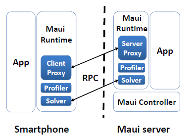
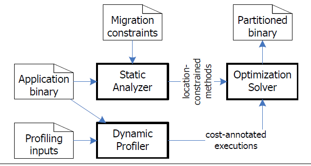

# 云-端融合下的端设备能耗优化

内容简介：“云-端融合”的技术理念可利用云端资源来弥补端移动设备相对于传统计算设备在计算、存储，特别是能源等方面资源受限的不足，在此融合过程中更需要考虑端移动设备能耗的优化使用以提高端上应用的用户体验。本文对当前移动端设备上应用能耗优化基础技术进行分类，包括应用能耗度量技术、应用能耗漏洞检测及修复技术和应用能耗优化方法，调研了云-端融合的工业应用产品，包括语音识别应用、云浏览器、云游戏等，并着重探讨了基于计算迁移的云-端融合应用能耗优化方法，为云-端融合背景下应用能耗优化研究提供基础。

## 端设备能耗优化基础技术研究

### 应用能耗度量

在研究应用的能耗优化方法之前，当然首先要知道应用的能耗如何度量。应用的能耗最终是硬件设备运转的结果，因此能耗度量最直接的方式是进行硬件层面的度量。

在Android系统中，存在一个配置文件记录了各个硬件组件在不同的工作状态下的能耗速率，称为能耗配置文件。各个硬件组件的能耗速率受到自身工作状态的影响。由于Android设备的多样性，不同类型的设备所包含的硬件组件的类型不同，它们在相同的工作状态下的能耗速率也不一样，因此能耗配置文件必须由不同的设备生产厂商提供。厂商依赖于一些外部设备，这种“离线”方式给出的能耗属性无法在运行时进行更新。因此，Lide Zhang等人的一些工作[1~4]提出了“在线”方式，利用Android系统提供的读取电池信息（电压、电流、剩余电量）的接口，在用户正常使用设备的过程中收集硬件组件的工作状态与对应的整个设备的能耗速率，通过回归分析的方式产生自己的能耗配置文件。而要度量某一应用的能耗，只要记录该应用使用各个硬件组件的情况，例如，该应用使用了CPU多长时间，这段时间内CPU的工作状态如何，等等。

除了从硬件层面进行应用能耗度量，还有一些工作从应用源码或字节码层面进行应用能耗度量。例如Shuai Hao等人的工作[5~6]对每一条CPU指令的能耗进行建模，其方法是对每一条CPU指令，循环执行2000万次，用外部设备测量其能耗，以此获得该CPU指令执行一次的能耗。在应用运行时，计算应用运行路径上的所有字节码对应的CPU指令的能耗之和，当作应用的能耗。

### 应用能耗漏洞检测及修复

能耗漏洞，或称为能耗Bug，是相对于传统的功能性Bug而言的。能耗Bug不会影响应用的功能，也不会引起应用崩溃，只会让应用消耗更多的电量，并且用户往往很难发现。

典型的能耗Bug例如No-sleep Bug。Android系统为了省电，会在用户无操作一段时间后进入休眠状态，但这经常会影响一些应用的功能。于是Android系统提供了WakeLock机制。WakeLock是一种锁机制，只要系统中有应用申请了WakeLock，系统就无法进入休眠状态，直到WakeLock被释放。然而有些应用申请了WakeLock，却忘记将它释放，或由于某些原因没有执行到释放WakeLock的代码，导致系统永远无法进入休眠状态，这样就产生了一个No-sleep Bug。Abhinav Pathak等人的工作[7]通过数据流分析的方法检测可能导致No-sleep Bug的运行路径，并添加释放WakeLock的代码来进行修复。

另一类能耗Bug称作Sensor-related Bug。某些Android应用会申请一些能耗较高的传感器资源，例如GPS，但在使用完后忘记将其释放，导致后台不断地获取传感器数据，而这些数据又无任何实际用途，造成能耗漏洞。可以看出，Sensor-related Bug与No-sleep Bug的模式非常类似，南京大学发表的工作[8]同样通过数据流分析的方法进行检测并修复。

能耗Bug不仅可以从应用的字节码来检测，还可以从应用的实际能耗行为来分析。例如Abhijeet Banerjee等人的工作[9]利用外部设备测量应用运行过程中的能耗，如果在应用运行之前和运行完毕后，设备的能耗行为不相似，则可以认为执行路径中存在能耗Bug。虽然这是一个利用外部设备的“离线”方法，但由于其目的是检测能耗Bug，因此并无大碍。

### 应用能耗优化方法

应用能耗优化有许多方法，它们的着眼点不同，针对的应用类型也不同。

例如，屏幕能耗占应用总能耗的一大部分，降低屏幕能耗能在很大程度上降低应用的能耗。而如今许多Android设备都配有OLED屏幕，其能耗不仅受到屏幕亮度，还受到显示的内容的颜色的影响，在屏幕亮度相同的条件下，显示暗一点的颜色，如黑色、灰色等，要比显示亮一点的颜色，如白色、黄色等的能耗更低。南京大学发表的工作[10]就据此对Android系统能耗配置文件中的屏幕能耗模型做出了改进。另外，Mian Dong等人的工作[11]指出，由于许多Web应用的背景色都是白色，这并不是一个节省能耗的做法，于是他们调整Web应用的配色方案，让面积更大的背景色变为黑色，以此来降低Web应用的能耗。当然这种方法不限于Web应用，许多背景色是白色的Android应用都可以针对屏幕能耗做出改进。

<tr>
  

    <td></td>
    <td></td>
  

</tr>

再例如，针对高能耗的GPS调用，Zhenyun Zhuang等人的工作[12]也提出了相应的应用能耗优化方法。比如利用能耗更低的基于无线网络的位置感知技术来代替GPS调用；利用加速度传感器来判断用户的运动状态，如果用户是静止的，则限制不必要的GPS调用；将来自不同应用的GPS调用请求进行同步以减少GPS的调用次数；调整GPS调用的请求参数，等等。最终达到了降低98%的GPS调用的能耗的效果。针对高能耗的Wi-Fi接入点扫描，Kyu-Han Kim等人的工作[13]也提出了根据用户的运动状态和Wi-Fi接入点的密度来调整Wi-Fi接入点扫描的间隔，最终达到了降低79%的Wi-Fi接入点扫描的次数的效果。

Ding Li等人的工作[14]从编码的角度出发，提出一些可以降低能耗的编程经验，并且对一些被推荐的编程经验（例如Android开发者网站上给出的一些建议[15]）进行实验验证，为应用开发者提供降低能耗的指导建议。Mario Linares-Vásquez等人的工作[16]将外部设备测出的能耗数据与执行路径对应起来，统计每个API调用的能耗，并提出了避免使用能耗高的API，而尽量使用功能相同的能耗低的API，来降低应用能耗的方法。

Android系统自身也在针对应用能耗进行优化。例如Android运行时Dalvik和ART，Dalvik采用即时编译策略，在程序运行时将字节码翻译成机器码来执行，这样运行时开销就增加了，能耗也就增加了；新的运行时ART采用预编译策略，在程序安装时就将字节码翻译成机器码，降低了运行时开销，也就降低了能耗。

## 云-端融合的工业应用产品

### 语音识别

语音识别是当前应用较为广泛的云-端融合技术的应用场景，各类移动应用集成语音识别功能为用户提供友好的文字输入界面。因语音识别技术一般需要通过神经网络算法进行复杂计算后完成语音识别过程，而移动设备本身不具备进行如此重量级计算的资源，因此用户在移动端设备上进行语音采集后编码压缩为数字格式并通过无线网络传输到云服务器，服务器通过将该语音信号和某一统计模型进行比较，猜测最可能且合理的对应文字内容，并将结果返回。而类似Siri等语音助手，还需要进一步将人工智能、人机交互及智能搜索等技术紧密地联系起来，在云端实现对用户所说的话进行理解，并快速寻找答案以语音的方式回答用户。

### 亚马逊云浏览器

亚马逊公司在其推出的Fire平板电脑上安装了Silk浏览器，该浏览器的架构体现了较为典型的云-端融合技术特点。当用户选择以“云模式”运行时，Silk将用户输入的URL直接传递到Amazon的EC2云服务，在EC2云服务端完成该URL相关的HTML、CSS、图片、JavaScript等资源。在此过程中EC2云服务还可为Silk浏览器进行资源优化，例如根据客户端分辨率自动进行所下载图片的处理以适配端设备分辨率，并且EC2云服务中还可实现机器学习算法以预测用户将访问的内容，通过对内容预加载实现用户浏览的加速。此外，Silk还可将部分渲染过程相关计算off-load到Amazon的EC2云服务，包括HTML、CSS和JS等文件的解析和渲染树构造等步骤，进一步提升用户渲染过程的效率。

### Nvidia“游戏即服务”

以在线流媒体方式从云端获取音乐和电影成为当前内容消费的主要形式。这一云资源应用形态也在被用于计算机游戏行业。NVIDIA公司正在开发的GRID云游戏技术在云端服务器内将3D游戏进行渲染和编码，并以流方式将结果通过有线或无线网络传输到用户的各类设备。游戏软件的升级无需用户进行下载、打补丁甚至重新安装，游戏软件对底层软硬件的升级要求也无需用户进行相应更新。用户个性配置和进度都在云端保存，这一技术使得用户任何时刻都可以在电视、PC、Mac、平板电脑和手机等各类设备上即时开启游戏，享受“游戏即为服务”（Gaming as a Service, GaaS)所带来的乐趣。

## 基于计算迁移的云-端融合应用能耗优化

在“云-端融合”的技术理念下，将应用的部分计算任务迁移到云端来执行，在利用云端丰富的计算资源（如CPU、内存等）的同时，也可以优化端移动设备上应用的能耗，其问题的关键在于如何进行计算任务迁移。该领域当前代表性研究工作包括MAUI、CloneCloud和DPartner等。

### 基于代码托管环境的MAUI系统

Eduardo Cuervo等人的工作[17]实现了能够将移动应用代码细粒度地迁移到云端运行的MAUI系统。在这份工作之前，代码迁移工作要么严重依赖于开发人员实现应用代码划分，要么就是粗粒度地将所有应用代码进行迁移。MAUI利用托管代码环境（例如微软.NET公共语言运行时）来实现细粒度的代码迁移，同时减轻开发人员的负担。MAUI在应用运行时决定哪些代码迁移到云端运行可以降低应用的能耗。

MAUI提供一个开发环境，开发人员在该环境中注释出那些可以迁移到云端运行的方法，称为remoteable方法。在应用运行时，每当这些remoteable方法被调用并且有可用的远程服务器时，MAUI就用它的决策引擎来决定该方法是否应该迁移到远程执行以降低应用的能耗。MAUI通过统计remoteable方法迁移到远程执行所需要传输的状态信息的数量，来分析迁移的成本，通过统计利用迁移节省的CPU周期的数量，来分析迁移的收益。另外，MAUI持续地监控移动设备的网络情况，评估带宽和延迟，作为其决策引擎的参数，以此适应网络环境的变化。

如图所示为MAUI的系统架构。在移动设备上，MAUI主要包括三个组件：客户端代理（Client Proxy），负责待迁移方法的状态信息的传输；分析器（Profiler），负责分析方法迁移的成本和收益；决策引擎（Solver），为了降低能耗，它实际运行在MAUI服务器上。在MAUI服务器上，它主要包括四个组件：服务端代理（Server Proxy）和分析器（Profiler），与移动设备上相应的组件功能一致；决策引擎（Solver），定期地对方法是否需要迁移进行决策；以及MAUI控制器（MAUI Controller），用于对方法迁移请求进行身份验证和资源分配。实验中，MAUI将一个CPU密集型的脸部识别应用的核心算法迁移到远程执行，降低了该应用90%左右的能耗。

### 基于虚拟机克隆的CloneCloud系统

Byung-Gon Chun等人的工作[18]实现了功能与MAUI相似的CloneCloud系统。与MAUI一样，CloneCloud使用静态代码分析和动态环境分析相结合的方法，通过执行时间或能耗最优化求解器对应用进行划分。划分的流程如图所示。其中，静态分析器（Static Analyzer）通过静态代码分析，根据一系列限制条件（例如需要访问本地资源的代码必须留在本地执行）的判定，识别出可以迁移到云端运行的方法。这些方法相当于MAUI系统中通过开发人员注释出的remoteable方法，因此CloneCloud不需要开发人员的参与。动态分析器（Dynamic Profiler）结合本地和云端的网络环境等条件分析应用代码迁移的成本和收益，构造代码迁移的开销函数。最后由最优化求解器（Optimization Solver）给出一个执行时间最短或能耗最低的应用划分方法，将应用的一部分留在本地运行，另一部分迁移到云端运行。

如下图所示为CloneCloud的系统架构。CloneCloud在云端为移动设备创建克隆的虚拟机。在应用的运行过程中，如果遇到一个迁移节点，正在运行的线程会被阻塞，它的相关状态信息被发送到云端，由云端继续运行该线程，它可以访问云端的各种资源，例如更快的CPU、网络，更大的内存等等；本地应用的其他功能（线程）不会受到影响，但如果它们试图访问迁移到云端的线程的相关状态信息，就会进入阻塞状态；当迁移到云端的线程执行完毕时，相关的状态信息被发送回本地，合并到本地被阻塞的线程中去，本地被阻塞的线程将被唤醒并继续执行。在实验中，它降低了一个图片处理应用95%左右的能耗。

###基于应用重构的DPartner系统 

北京大学发表的工作[19]介绍了Android应用计算任务按需远程执行的一种方法。由于Android应用本质上是Java程序，由许多类组成，一项计算任务被实现为某个类中的某个方法，它可以被本类或其他类中的方法调用。因此，Android应用计算任务迁移可以实现为包含该计算任务的某个类的远程部署和调用。该工作首先提出了一种支持Android应用计算任务按需远程执行的程序结构，它主要包含两个核心元素：proxy和endpoint，如图所示。它将调用者X和被调用者N之间的直接内存调用以及通过RCS（Remote Communication Service，远程通信服务）的远程调用都转换成了经由proxy和endpoint进行的间接调用。NProxy的外部行为和N完全一致，只是它本身不执行任何实际的计算操作，只负责将方法调用转发到N执行。Endpoint负责获取N当前的位置并提供N的引用供X使用。若N运行在远程节点，则Endpoint会通过RCS获得N的远程引用，并把该引用以NProxy的形式提供给X使用；若N运行在本地节点，Endpoint会直接获得对N的内存引用，并同样以NProxy的形式提供给X使用。

在确定了支持Android应用计算任务按需远程执行的程序结构之后，该工作还设计实现了自动地对Android应用进行重构以符合该程序结构的工具——DPartner。它首先对Android应用中的类进行分类：必须留在本地执行的anchored类（它们使用了一些只能在本地才能获取的特殊资源，如GUI或传感器等）和可以被迁移到云端执行的movable类。然后进行应用类转换，当一个movable类被迁移到云端时，与之交互的类都需要被转换成可按需远程调用的结构，即生成被调用者的代理类proxy，并重写调用类来使用proxy。接着进行应用类聚类，为了使计算任务远程执行能够提高应用的性能，降低应用的能耗，必须避免频繁的网络调用所带来的负面影响，因此需要把相互间调用频繁的类作为一个整体迁移到云端执行。最后进行应用类封装，生成两部分制品，一部分是转换后留在本地运行的应用，另一部分是转换后的movable类组成的集合，部署到云端以供远程调用。

该工作还提出了计算任务是否需要远程执行的运行时决策模型，该模型基于各个应用类的工作负载、内存消耗，应用类之间的交互频率、传输数据量大小，本地和远程节点的处理能力、内存大小，以及它们之间的网络延迟等，以应用的性能与资源消耗的比值为目标，决定最终应用中的计算任务是否需要远程执行。实验表明，该工作可以降低计算密集型Android应用27~83%的能耗。

## 一点总结和思考 

云-端融合应用的出现实质上是在软件技术层面我们对于应用运行时的环境适应能力要求的一个体现，特别是在移动互联网和云计算技术并行快速发展的技术背景下，云-端融合应用可充分利用云计算资源为终端用户带来更为良好的使用体验。工业产品中的云-端融合应用在特定场景下实现固定模式的云-端融合技术方案，为移动端应用提供云端的计算、存储和网络等各类资源；学术界的研究则集中在更为灵活的融合模式的支撑和实现，以代码迁移实现运行时云端资源的动态利用。从这些云-端融合应用系统的软件架构来看，前者实际与传统客户机服务器模式并无显著差异，后者则体现了我们对这种固化的客户机服务器模式所进行的改进：在运行时决策应用组件的物理部署，实现动态可适应的新型分布式计算模型。

当然以这一新型分布式计算模型实现通用普适的云-端融合计算应用还亟待技术的改进和完善。一方面，当前所研究的代码迁移工作使用外部机制对代码进行重构分割，在缺少原有应用代码设计和实现语义的情况下可能带来性能不升反降的风险（例如分割迁移到云端的某个系统构件可能运行时与驻留于终端的构件存在大量通讯），因此，在语言和应用框架层面提供机制让开发者表达与代码迁移相关的元层设计语义可能是云-端融合技术在软件技术层面的一个研究方向。另一方面，当前融合技术基于虚拟机或代码托管环境状态支持代码的在线迁移，但一般都预先作了迁移两端环境同构的假设，而实际上这一点对于通用的云-端融合技术应用场景而言也是未必成立的，代码在端到云、云到端、云到云和端到端间迁移必然需要考虑环境（包括硬件平台和软件栈等）异构的问题，因此云-端融合应用在运行支撑方面更需要融入当前容器等高层应用封装、部署和管理技术，构造真正支持以按需方式、通过在不同计算平台上自由流动实现高效、智能资源利用的新一代应用形态。

## 参考文献

[1] Zhang L, Tiwana B, Qian Z, et al. Accurate online power estimation and automatic battery behavior based power model generation for smartphones[C]//Proceedings of the eighth IEEE/ACM/IFIP international conference on Hardware/software codesign and system synthesis. ACM, 2010: 105-114.

[2] Dong M, Zhong L. Self-constructive high-rate system energy modeling for battery-powered mobile systems[C]//Proceedings of the 9th international conference on Mobile systems, applications, and services. ACM, 2011: 335-348.

[3] Jung W, Kang C, Yoon C, et al. DevScope: a nonintrusive and online power analysis tool for smartphone hardware components[C]//Proceedings of the eighth IEEE/ACM/IFIP international conference on Hardware/software codesign and system synthesis. ACM, 2012: 353-362.

[4] Xu F, Liu Y, Li Q, et al. V-edge: Fast self-constructive power modeling of smartphones based on battery voltage dynamics[C]//Presented as part of the 10th USENIX Symposium on Networked Systems Design and Implementation (NSDI 13). 2013: 43-55.

[5] Hao S, Li D, Halfond W G J, et al. Estimating Android applications' CPU energy usage via bytecode profiling[C]//Proceedings of the First International Workshop on Green and Sustainable Software. IEEE Press, 2012: 1-7.

[6] Hao S, Li D, Halfond W G J, et al. Estimating mobile application energy consumption using program analysis[C]//Software Engineering (ICSE), 2013 35th International Conference on. IEEE, 2013: 92-101.

[7] Pathak A, Jindal A, Hu Y C, et al. What is keeping my phone awake?: characterizing and detecting no-sleep energy bugs in smartphone apps[C]//Proceedings of the 10th international conference on Mobile systems, applications, and services. ACM, 2012: 267-280.

[8] Liu Y, Xu C, Cheung S C. Where has my battery gone? Finding sensor related energy black holes in smartphone applications[C]//Pervasive Computing and Communications (PerCom), 2013 IEEE International Conference on. IEEE, 2013: 2-10.

[9] Banerjee A, Chong L K, Chattopadhyay S, et al. Detecting energy bugs and hotspots in mobile apps[C]//Proceedings of the 22nd ACM SIGSOFT International Symposium on Foundations of Software Engineering. ACM, 2014: 588-598.

[10] Lu Z, Cao C, Tao X P. Improing Screen Power Usage Model on Android Smartphones[C]//2015 Asia-Pacific Software Engineering Conference (APSEC). IEEE, 2015: 167-173.

[11] Dong M, Zhong L. Chameleon: a color-adaptive web browser for mobile OLED displays[J]. Mobile Computing, IEEE Transactions on, 2012, 11(5): 724-738.

[12] Zhuang Z, Kim K H, Singh J P. Improving energy efficiency of location sensing on smartphones[C]//Proceedings of the 8th international conference on Mobile systems, applications, and services. ACM, 2010: 315-330.

[13] Kim K H, Min A W, Gupta D, et al. Improving energy efficiency of Wi-Fi sensing on smartphones[C]//INFOCOM, 2011 Proceedings IEEE. IEEE, 2011: 2930-2938.

[14] Li D, Halfond W G J. An investigation into energy-saving programming practices for android smartphone app development[C]//Proceedings of the 3rd International Workshop on Green and Sustainable Software. ACM, 2014: 46-53.

[15] [http://developer.android.com/training/articles/perf-tips.html](http://developer.android.com/training/articles/perf-tips.html)

[16] Linares-Vásquez M, Bavota G, Bernal-Cárdenas C, et al. Mining energy-greedy api usage patterns in android apps: an empirical study[C]//Proceedings of the 11th Working Conference on Mining Software Repositories. ACM, 2014: 2-11.

[17] Cuervo E, Balasubramanian A, Cho D, et al. MAUI: making smartphones last longer with code offload[C]//Proceedings of the 8th international conference on Mobile systems, applications, and services. ACM, 2010: 49-62.

[18] Chun B G, Ihm S, Maniatis P, et al. Clonecloud: elastic execution between mobile device and cloud[C]//Proceedings of the sixth conference on Computer systems. ACM, 2011: 301-314.

[19] Zhang Y, Huang G, Liu X, et al. Refactoring android java code for on-demand computation offloading[C]//ACM SIGPLAN Notices. ACM, 2012, 47(10): 233-248.
